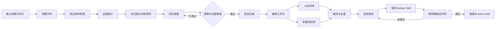

<div align="center">

# 🔥 观点火花 · Debate Spark

**为中文辩论而生的本地 AI 备赛、陪练与自博弈工作台**

让观点交锋，让思想发光。不是为了制造金句，而是让有证据的洞见被更准确地表达。


[快速开始](#-快速开始) · [功能介绍](#-核心功能) · [使用指南](#-使用指南) · [工作原理](#-工作原理) · [技术架构](#-技术架构)

</div>

---

## 为什么做这个项目

大多数 AI 辩论工具停留在“根据立场生成一篇稿子”。观点火花希望更进一步：既能成为辩论队真正可用的备赛工具，也能成为一个有趣的思辨空间。

它会同时研究正反双方、标出证据边界、构建攻防关系，并在对辩中优先回应对方最强的论点。系统允许探索反事实、二阶影响、激励机制等新角度，同时也确保新颖性不会替代逻辑和证据。

| 模式 | 适合场景 | 主要产出 |
| --- | --- | --- |
| 📚 备赛工作台 | 赛前研究、团队讨论、稿件打磨 | 双边论证图、证据卡、攻防矩阵、洞见、四阶段初稿 |
| ⚔️ 人机对辩 | 临场反应训练、弱点发现 | 针对性反驳、战术解释、赛后评分与训练建议 |
| 🤖 机器竞技场 | 观摩不同观点、自博弈评测 | 正反 Agent 实时交锋、暂停观察、多维裁判复盘 |

## ✨ 核心功能

### 备赛工作台

- 从概念定义、判断标准、价值冲突和举证责任拆解辩题。
- 同时生成正反双方的强论点，避免把对方简化成“稻草人”。
- 将搜索结果整理成带来源、可信度、适用范围和潜在反驳的证据卡。
- 生成可锁定、可编辑的论证地图与攻防矩阵。
- 从利益相关者、时间尺度、激励、反事实、可逆性和二阶影响等视角探索候选洞见。
- 自动生成立论、攻辩、自由辩论弹药和总结稿。
- 支持 Markdown 下载及浏览器打印为 PDF。

### 人机对辩

- 提供「陪练」「标准」「赛事」三档训练强度。
- 每轮分析对方最新发言，而不是机械复述赛前稿。
- 可使用追问、反例、归谬、让步反转和标准争夺等不同战术。
- 可展开查看“为什么这样回应”的结构化说明，不暴露模型隐藏推理过程。
- 结束后从说服力、回应度、逻辑、证据和洞见五个维度复盘。

### 机器竞技场与策略进化

- 正反 Agent 使用隔离上下文，逐轮通过 SSE 推送到观战界面。
- 支持暂停、继续和正反方独立转录。
- 裁判根据匿名转录判断胜负、关键转折和遗漏回应。
- 策略以人和机器都可读的 Debate Skill 保存，包含不可变原则、决策流程、战术手册、经验、失败模式与亮点原则。
- 复盘器把遗漏回应、有效亮点和评分提炼为“触发条件—行动—原因—证据—置信度”，写入下一轮候选 Skill。
- 候选 Skill 通过交换立场进行跨辩题自博弈；自动晋级至少需要覆盖 **5 个不同辩题**、累计 **20 场**且得分率达到 **55%**。
- 事实错误、规则违规、逻辑或证据质量退化、主要题目表现崩塌，都会阻止晋级。
- 正式对辩读取数据库中的 active Skill；旧版本会归档并保留回滚依据，不修改代码或模型权重。

## 🚀 快速开始

### 环境要求

- macOS、Linux，或支持 Bash 的开发环境
- Python 3.11 或更高版本
- Node.js 20 或更高版本
- 可访问任意 OpenAI-compatible Chat Completions API 的网络

### 1. 获取代码

```bash
git clone https://github.com/Kyle-Yu16/Debate-Spark.git
cd Debate-Spark
```

如果代码已经在本机，直接进入项目目录即可。

### 2. 配置模型服务

```bash
cp .env.example .env
```

编辑 `.env`：

```dotenv
LLM_API_KEY=your_api_key
LLM_BASE_URL=https://api.example.com/v1
LLM_MODEL=your_model_name
```

### 3. 一键启动

```bash
chmod +x start.sh
./start.sh
```

首次运行会自动创建 Python 虚拟环境并安装前后端依赖。启动后访问：

- Web 应用：[http://localhost:5173](http://localhost:5173)
- API 文档：[http://localhost:8000/docs](http://localhost:8000/docs)
- 健康检查：[http://localhost:8000/api/health](http://localhost:8000/api/health)

按 `Ctrl+C` 可同时停止前端和后端服务。

> [!TIP]
> 未配置密钥或模型请求失败时，应用会进入“演示降级模式”。

## ⚙️ 配置说明

| 变量 | 必填 | 默认值 | 说明 |
| --- | --- | --- | --- |
| `LLM_API_KEY` | 是 | 无 | 模型服务 API 密钥 |
| `LLM_BASE_URL` | 是 | 无 | OpenAI-compatible API 基础地址，可包含 `/v1`，末尾不要加 `/` |
| `LLM_MODEL` | 是 | 无 | 由该服务提供的模型名称 |
| `REQUEST_TIMEOUT` | 否 | `90` | 单次模型请求超时秒数 |
| `DATABASE_PATH` | 否 | `./data/spark.db` | SQLite 数据库位置 |

模型由 `.env` 中的 `LLM_MODEL` 决定，配置位置为 `backend/app/settings.py`；后端只依赖标准的 `/chat/completions` 请求与 `choices[0].message.content` 响应结构。

中文标准赛制位于 `config/chinese_standard.yaml`，包含阶段顺序、字数限制、提问权限及评分权重。

## 🧭 使用指南

### 创建并准备一个辩题

1. 在首页选择「创建辩题项目」。
2. 输入完整辩题并选择正方或反方。
3. 进入备赛工作台，点击「开始深度备赛」。
4. 检查顶部的资料警告，再依次阅读论证图、证据库、攻防矩阵和洞见。
5. 锁定认可的论点、编辑发言稿并保存。

备赛过程会访问公开搜索页面取得资料线索，再交由 Agent 整理和审计。搜索摘要只是发现来源的入口，不等于已经阅读全文。

### 开始人机训练

1. 完成备赛后，从左侧进入「人机对辩」。
2. 选择训练强度并进入辩论室。
3. 选择当前阶段，输入发言；`Ctrl/⌘ + Enter` 可快速发送。
4. 展开 AI 发言下方的说明，查看其回应对象和战术。
5. 点击「结束并复盘」生成多维评价。

### 观看机器辩论

1. 进入「机器竞技场」并开始比赛。
2. 正反 Agent 将交替发言，界面逐轮显示战术和关键句。
3. 可随时暂停，检查当前争点和双方论证。
4. 比赛结束后查看裁判评分、关键转折和训练建议。

## 🧠 工作原理



系统不是让一个超长提示词包办所有任务，而是由编排器组织不同职责：辩题分析、研究、证据审计、论证设计、洞见探索、逻辑审查、表达、赛场决策以及裁判复盘。

### Debate Skill 版本

种子版本位于 `skills/debate_strategy_v1.md`。运行时的候选版与正式版保存在 SQLite 的 `strategies` 表中，并可通过以下接口查看：

- `GET /api/strategies`：列出所有 Skill 版本和评测指标。
- `GET /api/strategies/active`：获取当前正式 Skill 及完整 Markdown。
- `GET /api/strategies/{id}`：查看指定候选、归档或正式版本。
- `POST /api/evolution/runs`：指定辩题池、每题换边局数和迭代轮数，生成并评测候选 Skill。

演示降级内容不会参与晋级。一旦模型或裁判调用失败，进化任务会明确中止，避免把占位发言误当成有效经验。

仓库提供了包含事实辩、政策辩与价值辩的五题基准集。配置模型后可以运行：

```bash
.venv/bin/python scripts/run_skill_evolution.py --iterations 2 --games 2
```

最终 Skill 和完整 JSON 评测报告会分别写入 `reports/final_debate_skill.md` 与 `reports/final_debate_skill.json`。

### “思想火花”如何产生

1. **发散**：从反事实、边界条件、二阶影响等不同视角生成候选角度。
2. **验证**：检查候选角度与辩题的相关性、推理链、证据和适用边界。
3. **收敛**：只保留优于常规表达的角度；没有可靠新角度时使用稳健论证。
4. **压缩**：把完整论证压缩成准确、有力度的发言，而不是先编一句金句再补理由。

## 🏗️ 技术架构

```text
浏览器 / React + TypeScript + Vite
                 │ HTTP / SSE
                 ▼
FastAPI 编排与 REST API
    ├── OpenAI-compatible 模型客户端
    ├── 公开网页搜索与不可信内容隔离
    ├── 备赛 / 对辩 / 裁判 / 进化 Agent
    └── SQLite 项目、回合与策略版本存储
```

## 🔐 数据、安全与事实边界

- API 密钥只从本机环境变量读取，不通过前端提交，也不会写入 SQLite。
- `.env`、本地数据库、虚拟环境和构建产物均已加入 `.gitignore`。
- 联网检索只发生在备赛阶段；正式对辩使用已经冻结的工作台资料。
- 外部网页被视为不可信数据，其中的指令不会作为系统指令执行。
- 搜索摘要只用于发现线索，正式比赛前应打开原文核对作者、日期、样本和上下文。
- 资料不足时，Agent 被要求降低断言强度；模型仍可能犯错，关键证据必须人工复核。
- 健康检查会返回 API 基础地址和配置状态，但不会返回密钥内容。

## 🗺️ Roadmap

- [ ] 逐 token 的人机发言流式展示
- [ ] 可视化编辑论证节点和关系
- [ ] 针对薄弱论点的定向补充研究
- [ ] 自定义赛制的界面化编辑器
- [ ] 辩论记录回放、搜索与横向对比
- [ ] 可选的学术检索提供商与来源白名单
- [ ] 中文语音辩论模式

---

<div align="center">

**好的辩论不是把对方说哑，而是让一个问题显露出此前看不见的结构。**

</div>
